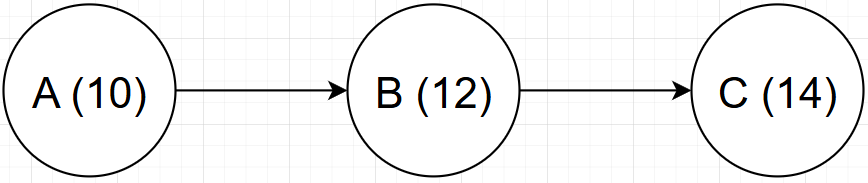
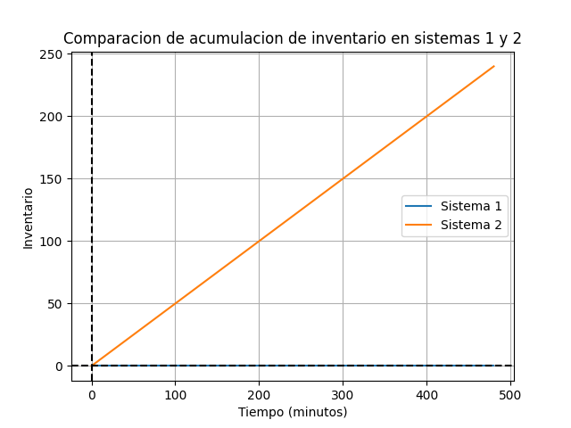
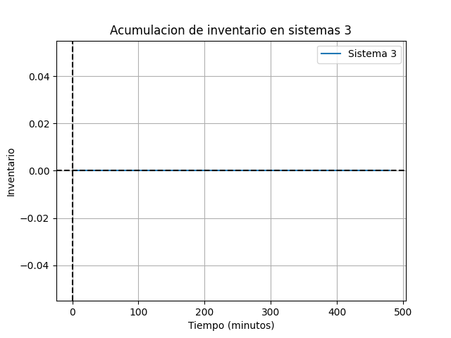

### Informe de Resultados

**Disclaimer:**

Este informe está organizado en un formato donde los resultados se presentan antes del desarrollo del trabajo. Esto se debe a la naturaleza del análisis realizado, el cual fue implementado utilizando Python. Toda la documentación del código, los scripts utilizados, y cualquier otro material relevante serán adjuntados en la entrega para garantizar la transparencia y reproducibilidad del proceso de análisis.

#### Introducción

Este informe presenta los resultados obtenidos en dos problemas diferentes de análisis de procesos, los cuales fueron modelados y resueltos utilizando simulaciones programadas en Python. Los problemas corresponden a la organización de la entrada de personas a un estadio durante los Juegos Olímpicos y a la gestión de una jornada de vacunación para perros. A continuación, se describen los resultados obtenidos para el primero de estos escenarios, basados en el análisis de los tiempos, capacidades y costos operativos.

---

#### Pregunta 1: Organización de la Entrada al Estadio

**Diagrama del Proceso**



| Actividad                | Letra asignada | Estaciones | Tiempo     |
|--------------------------|----------------|------------|------------|
| Escanear la credencial   | A              | 10         | 2 min/👤   |
| Revisión de seguridad    | B              | 12         | 5 min/👤   |
| Asignación de ruta       | C              | 14         | 4 min/👤   |

En este escenario, se consideraron tres etapas para que una persona pueda ingresar al estadio:
1. **Escanear la credencial**: 10 estaciones, 2 min/persona.
2. **Revisión de seguridad**: 12 estaciones, 5 min/persona.
3. **Asignación de ruta**: 14 personas encargadas, 4 min/persona.

Si el sistema se encuentra vacío, entonces un usuario se demora 11 minutos en pasar por todo el proceso.

**Análisis Numérico**

- **Actividad A**: Capacidad de 5.0 personas/minuto.
- **Actividad B**: Capacidad de 2.4 personas/minuto (cuello de botella).
- **Actividad C**: Capacidad de 3.5 personas/minuto.

La capacidad total del sistema se determinó en 2.4 personas/minuto, siendo la Actividad B el cuello de botella del proceso. Las tasas de utilización fueron las siguientes:
- Actividad A: 48.00%
- Actividad B: 100.00%
- Actividad C: 68.57%

**Inventario en 8 horas laborales**

El inventario promedio fue de 2.4 personas y la cantidad total de personas que ingresaron durante 8 horas fue de 1152 personas/hora.



**Análisis de Aumento de Personas**

Para ingresar un 50% más de personas, se determinó que la acumulación de inventario promedio simple sería de 3.6 personas. Se concluyó que sería necesario ampliar las capacidades del cuello de botella (Actividad B) y la siguiente actividad en la cadena (Actividad C) para evitar la acumulación de inventario.



**Fallas en las Máquinas**

Se consideraron las siguientes disminuciones en la eficiencia de las actividades:
- **Actividad A**: 95% de eficiencia, capacidad reducida a 4.75 personas/minuto.
- **Actividad B**: 90% de eficiencia, capacidad reducida a 2.16 personas/minuto.
- **Actividad C**: 70% de eficiencia, capacidad reducida a 2.45 personas/minuto.

**Decisión sobre Mejoras**

Se compararon dos estrategias para mejorar la eficiencia de la Actividad B:
1. Aumentar la eficiencia al 100%.
2. Incrementar la cantidad de estaciones.

Los cálculos mostraron que el beneficio de aumentar la eficiencia de B al 100% era de -518.4 USD, mientras que el beneficio de aumentar la cantidad de estaciones era de -194.4 USD. Dado que el costo de aumentar la eficiencia era de 40 USD y el costo de aumentar una estación era de 15 USD, se concluyó que era más conveniente aumentar la cantidad de estaciones de la Actividad B.

---

#### Conclusión

Ambos problemas presentan desafíos únicos en la gestión de operaciones. El análisis numérico y gráfico permitió identificar cuellos de botella y sugerir mejoras en la capacidad y eficiencia de los procesos. Las decisiones tomadas se fundamentaron en un análisis detallado de las capacidades, tiempos de espera, y costos operativos, lo que asegura una gestión más eficiente y costo-efectiva de los recursos disponibles.

---

### Documentación del Código

#### Introducción
El presente código se ha desarrollado para resolver problemas relacionados con el análisis de procesos, específicamente en el contexto del curso de "Gestión de Operaciones" en la carrera de Ingeniería Industrial. El algoritmo implementado se divide en varias clases y funciones, cuya finalidad es modelar un sistema de producción con múltiples actividades, identificar el cuello de botella, calcular la capacidad del sistema y evaluar el impacto de diferentes configuraciones en la eficiencia operativa.

#### Importación de Bibliotecas
```python
import matplotlib.pyplot as plt
import numpy as np
from math import ceil
```
Se importan las bibliotecas necesarias para la visualización de datos y cálculos matemáticos. `matplotlib.pyplot` se utiliza para generar gráficos, `numpy` para operaciones numéricas, y `math.ceil` para redondeo hacia arriba de valores en cálculos de capacidad.

#### Definición de Clases

##### Clase `Actividad`
```python
class Actividad:
    def __init__(self, letra, estaciones, tiempo):
        self.letra = letra
        self.estaciones = estaciones
        self.tiempo = tiempo
        self.capacidad = 0
        self.utilizacion = 0
        self.cuello_botella = False
```
La clase `Actividad` representa una etapa dentro de un proceso productivo. Sus atributos incluyen la letra identificativa de la actividad, el número de estaciones, el tiempo de procesamiento por unidad y variables calculadas como la capacidad y la utilización. La variable `cuello_botella` es un indicador booleano que identifica si la actividad es el cuello de botella del sistema.

```python
def calcular_capacidad(self):
    self.capacidad = self.estaciones / self.tiempo
```
El método `calcular_capacidad` determina la capacidad de la actividad, calculada como el cociente entre el número de estaciones y el tiempo de procesamiento por unidad.

##### Clase `Sistema`
```python
class Sistema:
    def __init__(self, actividades, tasa_entrada=0):
        self.tasa_entrada = tasa_entrada
        self.actividades = actividades
        self.actividad_cuello_botella = None
        self.capacidad = 0
        self.tiempo_flujo = 0
        self.tiempo_ciclo = 0
        self.tiempo_produccion = 0
```
La clase `Sistema` encapsula las características y dinámicas de un sistema de producción compuesto por múltiples actividades. Además de almacenar una lista de actividades, esta clase contiene atributos para la tasa de entrada, la capacidad total del sistema, y diversos tiempos clave en la operación del sistema.

```python
def calcular_cuello_botella(self):
    for actividad in self.actividades:
        actividad.calcular_capacidad()
    self.actividad_cuello_botella = min(self.actividades, key=lambda x: x.capacidad)
    self.actividad_cuello_botella.cuello_botella = True
    self.capacidad = self.actividad_cuello_botella.capacidad
```
El método `calcular_cuello_botella` identifica cuál actividad tiene la menor capacidad, y por lo tanto, representa el cuello de botella. Una vez identificada, se marca dicha actividad con el atributo `cuello_botella`, y se asigna su capacidad como la capacidad total del sistema.

```python
def calcular_tiempos(self, N):
    self.tiempo_flujo = sum([actividad.tiempo for actividad in self.actividades])
    self.tiempo_ciclo = 1 / self.tiempo_flujo
    self.tiempo_produccion = (N - 1)/self.capacidad * self.tiempo_flujo
```
Este método calcula varios tiempos clave: el tiempo de flujo total como la suma de los tiempos de todas las actividades, el tiempo de ciclo como el inverso del tiempo de flujo, y el tiempo de producción necesario para producir `N` unidades.

```python
def calcular_utilizacion(self):
    for actividad in self.actividades:
        actividad.utilizacion = min(self.capacidad, self.tasa_entrada) / actividad.capacidad
```
`calcular_utilizacion` estima la utilización de cada actividad basada en la tasa de entrada y la capacidad de la actividad.

#### Funciones de Cálculo

##### Función `calcular_little`
```python
def calcular_little(L, W, lam):
    if L == -1:
        return W * lam
    elif W == -1:
        return L / lam
    else:
        return L / W
```
Esta función implementa la Ley de Little, que relaciona el número promedio de clientes en el sistema (L), el tiempo promedio que un cliente pasa en el sistema (W), y la tasa de llegada de clientes (λ). Dependiendo de los parámetros disponibles, la función calcula el valor faltante.

##### Función `calcular_inventario_promedio`
```python
def calcular_inventario_promedio(L, W, lam):
    return calcular_little(L, W, lam) * calcular_little(L, W, lam) / lam
```
Esta función calcula el inventario promedio en el sistema, utilizando la Ley de Little para determinar los valores requeridos.

#### Ejecución Principal
El código principal inicia instanciando objetos `Actividad` y `Sistema`, calcula las capacidades, identifica el cuello de botella, y simula diferentes escenarios modificando la tasa de entrada y la capacidad de las actividades. Los resultados incluyen cálculos numéricos y gráficos para visualizar la acumulación de inventario.

#### Conclusión
El código implementado facilita la modelación y análisis de un sistema de producción, permitiendo identificar cuellos de botella y evaluar diferentes configuraciones operativas. Las clases y funciones definidas proporcionan una estructura clara y flexible para realizar cálculos complejos relacionados con la gestión de operaciones.