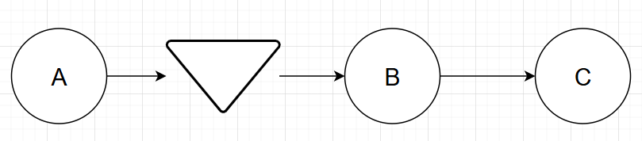
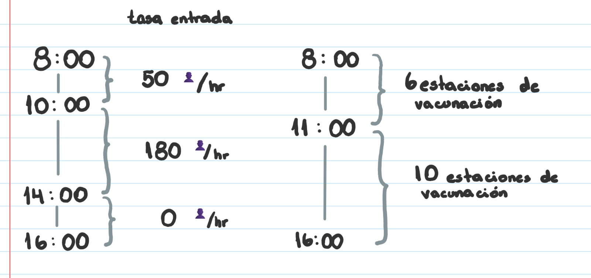
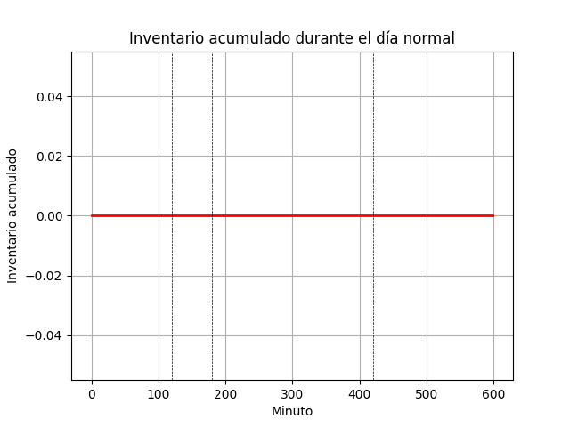
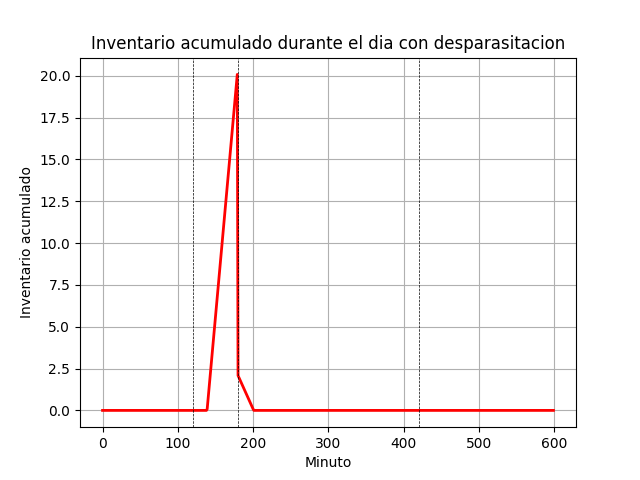

### Informe de Resultados

**Disclaimer:**

Este informe está organizado en un formato donde los resultados se presentan antes del desarrollo del trabajo. Esto se debe a la naturaleza del análisis realizado, el cual fue implementado utilizando Python. Toda la documentación del código, los scripts utilizados, y cualquier otro material relevante serán adjuntados en la entrega para garantizar la transparencia y reproducibilidad del proceso de análisis.

#### Introducción

Este informe presenta los resultados obtenidos en dos problemas diferentes de análisis de procesos, los cuales fueron modelados y resueltos utilizando simulaciones programadas en Python. Los problemas corresponden a la organización de la entrada de personas a un estadio durante los Juegos Olímpicos y a la gestión de una jornada de vacunación para perros. A continuación, se describen los resultados obtenidos para el segundo de estos escenarios, basados en el análisis de los tiempos, capacidades y costos operativos.

---

#### Pregunta 2: Jornada de Vacunación para Perros

**Diagrama del Proceso**



| Actividad                          | Letra asignada | Estaciones | Tiempo       |
|------------------------------------|----------------|------------|--------------|
| Inscripción y revisión de papeles  | A              | 10         | 1.5 min/👤   |
| Vacunación                         | B              | 10         | 2 min/👤     |
| Entrega de documentos              | C              | 10         | 0.5 min/👤   |

El proceso de vacunación se modeló con tres actividades principales:
1. **Inscripción y revisión de papeles**: 10 estaciones, 1.5 min/persona.
2. **Vacunación**: 10 estaciones, 2 min/persona.
3. **Entrega de documentos**: 10 estaciones, 0.5 min/persona.

En donde una persona se demora 4 minutos en ser atendido, es decir, en vacunar a un perro 💉🐶.



**Tiempos de Espera**

Se calcularon los tiempos de espera promedio en función del inventario acumulado a lo largo del día laboral, bajo diferentes condiciones de operación:
- De 08:00 AM a 10:00 AM: 0 minutos.
- De 10:00 AM a 11:00 AM: 0 minutos.
- De 11:00 AM a 14:00 PM: 0 minutos.
- De 14:00 PM a 16:00 PM: 0 minutos.



**Análisis de Costos**

Se realizó un análisis de costos asociado a la inclusión de un nuevo servicio de desparasitación:
- Costos fijos de espera: 0.05 USD.
- Costos fijos de veterinarios: 8160 USD.
- **Costos fijos totales del día**: 8160.05 USD.



**Propuesta de Reducción de Costos**

Se propuso la implementación de un sistema de voluntariado y preinscripción para reducir los costos asociados a la campaña de vacunación.

**Disminución de la Espera**

Dado que no se identificaron tiempos de espera significativos, se sugirieron mejoras para optimizar los costos operativos y aumentar la eficiencia del servicio ofrecido, como la preinscripción digital y la asignación de citas por día y hora.

---

#### Conclusión

Ambos problemas presentan desafíos únicos en la gestión de operaciones. El análisis numérico y gráfico permitió identificar cuellos de botella y sugerir mejoras en la capacidad y eficiencia de los procesos. Las decisiones tomadas se fundamentaron en un análisis detallado de las capacidades, tiempos de espera, y costos operativos, lo que asegura una gestión más eficiente y costo-efectiva de los recursos disponibles.

---

### Documentación del Código

#### Introducción
El código presentado tiene como objetivo resolver un problema de análisis de procesos en el contexto de "Gestión de Operaciones" para la carrera de Ingeniería Industrial. Este script simula un sistema de producción compuesto por múltiples actividades, analiza su desempeño bajo diferentes condiciones operativas y calcula tiempos, utilizaciones y costos asociados. La documentación a continuación explica el código clase por clase, función por función y línea por línea, con un enfoque en los algoritmos de resolución y las fórmulas utilizadas.

#### Importación de Bibliotecas
```python
import matplotlib.pyplot as plt
import numpy as np
from math import ceil
```
El script utiliza bibliotecas para gráficos (`matplotlib.pyplot`), cálculos numéricos (`numpy`), y operaciones matemáticas específicas (`math.ceil`), lo cual es fundamental para la representación visual de los resultados y la precisión en los cálculos de capacidad.

#### Definición de Clases

##### Clase `Actividad`
```python
class Actividad:
    def __init__(self, letra, estaciones, tiempo):
        self.letra = letra
        self.estaciones = estaciones
        self.tiempo = tiempo
        self.capacidad = 0
        self.utilizacion = 0
        self.cuello_botella = False
```
La clase `Actividad` modela cada etapa de un proceso productivo. Los atributos clave incluyen:
- `letra`: Identificador de la actividad.
- `estaciones`: Número de estaciones en paralelo.
- `tiempo`: Tiempo de procesamiento por unidad.
- `capacidad`: Calculada posteriormente como la relación entre estaciones y tiempo.
- `utilizacion`: Calculada como el cociente entre la tasa de entrada y la capacidad de la actividad.
- `cuello_botella`: Indica si la actividad es el cuello de botella del sistema.

```python
def calcular_capacidad(self):
    self.capacidad = self.estaciones / self.tiempo
```
Este método calcula la capacidad de la actividad, definida como el número de estaciones dividido por el tiempo de procesamiento.

##### Clase `Sistema`
```python
class Sistema:
    def __init__(self, actividades, tasa_entrada=0):
        self.tasa_entrada = tasa_entrada
        self.actividades = actividades
        self.actividad_cuello_botella = None
        self.capacidad = 0
        self.tiempo_flujo = 0
        self.tiempo_ciclo = 0
        self.tiempo_produccion = 0
```
La clase `Sistema` agrupa las actividades dentro de un proceso productivo, y gestiona la tasa de entrada, identificación del cuello de botella, capacidad total, y tiempos operativos. Se inicializan varias variables para almacenar estos datos y facilitar su cálculo posterior.

```python
def calcular_cuello_botella(self):
    for actividad in self.actividades:
        actividad.calcular_capacidad()
    self.actividad_cuello_botella = min(self.actividades, key=lambda x: x.capacidad)
    self.actividad_cuello_botella.cuello_botella = True
    self.capacidad = self.actividad_cuello_botella.capacidad
```
Este método identifica la actividad con menor capacidad como el cuello de botella, asigna esta capacidad como la capacidad total del sistema, y marca la actividad correspondiente.

```python
def calcular_utilizacion(self):
    for actividad in self.actividades:
        actividad.utilizacion = min(self.capacidad, self.tasa_entrada) / actividad.capacidad
```
`calcular_utilizacion` determina la utilización de cada actividad, calculada como la relación entre la tasa de entrada y la capacidad de la actividad.

#### Ejecución Principal

##### Pregunta 2.1
```python
# Creación de las actividades y sistemas
actividad_A = Actividad("A", 10, 1.5)
actividad_B = Actividad("B", 10, 2)
actividad_C = Actividad("C", 10, 0.5)
actividad_A_60 = Actividad("A", 6, 1.5)
actividad_B_60 = Actividad("B", 6, 2)
actividad_C_60 = Actividad("C", 6, 0.5)
sistema_full = Sistema([actividad_A, actividad_B, actividad_C])
sistema_60 = Sistema([actividad_A_60, actividad_B_60, actividad_C_60])

# Cálculo de capacidades y cuello de botella para sistema_full
sistema_full.calcular_cuello_botella()
sistema_full.calcular_utilizacion()
```
Aquí, se crean instancias de actividades y se configuran dos sistemas: uno a plena capacidad (`sistema_full`) y otro al 60% de su capacidad (`sistema_60`). Luego, para `sistema_full`, se calculan las capacidades y se identifica el cuello de botella.

##### Pregunta 2.2
```python
# Definición de condiciones de operación para el día laboral
sistema1 = Sistema([actividad_A_60, actividad_B_60, actividad_C_60], 50/60)
sistema2 = Sistema([actividad_A_60, actividad_B_60, actividad_C_60], 180/60)
sistema3 = Sistema([actividad_A, actividad_B, actividad_C], 180/60)
sistema4 = Sistema([actividad_A, actividad_B, actividad_C], 0)

# Cálculo de capacidades, cuellos de botella y utilizaciones para cada sistema
for sistema in [sistema1, sistema2, sistema3, sistema4]:
    sistema.calcular_cuello_botella()
    sistema.calcular_utilizacion()
```
Este bloque modela un día laboral típico, dividiendo las operaciones en cuatro intervalos temporales y asignando diferentes tasas de entrada y configuraciones de capacidad. Se calculan las capacidades y cuellos de botella para cada intervalo.

##### Gráfica de Inventario y Tiempos de Espera
```python
# Cálculo de inventarios acumulados y tiempos de espera
m1 = (sistema1.tasa_entrada - sistema1.capacidad)/sistema1.capacidad
inv1 = m1 * np.arange(0, 120, 1)
# (Análisis similar para sistema2, sistema3, sistema4...)
plt.plot(...)
```
Se calcula la pendiente del inventario acumulado a lo largo del día, considerando las tasas de entrada y salida. Luego, se grafica el inventario acumulado en función del tiempo y se estiman los tiempos de espera utilizando la Ley de Little.

##### Pregunta 2.3
```python
# Cálculo de costos operativos asociados a la actividad B
costo_B = 120/60
costo_fijo_B2 = 120 * 6 * 3 + 120 * 10 * 5
costo_fijo_espera = sum(waiting_times_2) * costo_espera
costos_fijos = costo_fijo_B2 + costo_fijo_espera
```
Finalmente, se analiza el costo de operación para la actividad `B` bajo diferentes configuraciones, considerando tanto los costos directos de operación como los costos asociados a los tiempos de espera.

#### Conclusión
Este código proporciona un marco robusto para modelar, analizar y optimizar sistemas productivos. Al simular diferentes escenarios de operación, es posible identificar cuellos de botella, calcular tiempos y costos asociados, y tomar decisiones informadas sobre la mejora del sistema.